========================
 elemapprox user manual
========================

+-------------------+----------------------------------------------------------+
| **Title**         | elemapprox (Elementary functions approximation in ANSI   |
|                   | C, Verilog HDL, and VHDL)                                |
+-------------------+----------------------------------------------------------+
| **Author**        | Nikolaos Kavvadias (C) 2013, 2014, 2015, 2016            |
+-------------------+----------------------------------------------------------+
| **Contact**       | nikos@nkavvadias.com                                     |
+-------------------+----------------------------------------------------------+
| **Website**       | http://www.nkavvadias.com                                |
+-------------------+----------------------------------------------------------+
| **Release Date**  | 22 August 2016                                           |
+-------------------+----------------------------------------------------------+
| **Version**       | 1.3.3                                                    |
+-------------------+----------------------------------------------------------+
| **Rev. history**  |                                                          |
+-------------------+----------------------------------------------------------+
|        **v1.3.3** | 2016-08-22                                               |
|                   |                                                          |
|                   | Add ``fmin``, ``fmax`` for C, Verilog, and VHDL.         |
+-------------------+----------------------------------------------------------+
|        **v1.3.2** | 2016-02-27                                               |
|                   |                                                          |
|                   | Fix ASCII rendering of function plots in the             |
|                   | documentation.                                           |
+-------------------+----------------------------------------------------------+
|        **v1.3.1** | 2015-12-25                                               |
|                   |                                                          |
|                   | Documentation updated with function plot examples.       |
+-------------------+----------------------------------------------------------+
|        **v1.3.0** | 2014-10-12                                               |
|                   |                                                          |
|                   | Added ``ansicstd`` version which is an alternative C port|
|                   | that calls the standard C library mathematical functions |
|                   | as defined in ``math.h``. Documentation updated.         |
+-------------------+----------------------------------------------------------+
|        **v1.2.0** | 2014-10-10                                               |
|                   |                                                          |
|                   | Added ``vhdlieee`` version which is compatible to the    |
|                   | IEEE ``math_real`` package. Documentation updated.       |
+-------------------+----------------------------------------------------------+
|        **v1.1.0** | 2014-10-07                                               |
|                   |                                                          |
|                   | Added VHDL version for approximating and plotting the    |
|                   | elementary functions. Numerous documentation fixes.      |
+-------------------+----------------------------------------------------------+
|        **v1.0.1** | 2014-09-24                                               |
|                   |                                                          |
|                   | Minor documentation corrections.                         |
+-------------------+----------------------------------------------------------+
|        **v1.0.0** | 2014-09-16                                               |
|                   |                                                          |
|                   | Initial release. This is an expanded version built upon  |
|                   | Mark G. Arnold's Verilog Transcendental Functions paper. |
+-------------------+----------------------------------------------------------+

1. Introduction
===============

``elemapprox`` is an ANSI C code, Verilog HDL and VHDL collection of modules 
(Verilog HDL) and packages (VHDL) that provide the capability of evaluating and 
plotting transcendental functions by evaluating them in single precision. The 
original work supports ASCII plotting of a subset of the functions; this version 
provides a more complete list of functions in addition to bitmap plotting for 
the transcendental functions as PBM (monochrome) image files. 

``elemapprox`` has been conceived as an extension to Prof. Mark G. Arnold's work 
as puhlished in HDLCON 2001. Most functions have been prefixed with the letter 
``k`` in order to avoid function name clashes in both ANSI C and Verilog HDL 
implementations. Currently, the plain VHDL version uses unprefixed names (e.g. 
acos instead of kacos). An alternative VHDL version named ``vhdlieee`` is 
compatible to the ``IEEE.math_real`` package and features prefixed names.

The transcendental functions supported include most elementary functions 
(hence the name ``elemapprox``) and the list is as follows:

+-----------------------+------------------------------------------------------+
| Function              | Description                                          |
+-----------------------+------------------------------------------------------+
| ``kfabs(x)``          | Floating-point absolute value (helper function).     |
+-----------------------+------------------------------------------------------+
| ``kfmin(x,y)``        | Floating-point minimum value (helper function).      |
+-----------------------+------------------------------------------------------+
| ``kfmax(x,y)``        | Floating-point maximum value (helper function).      |
+-----------------------+------------------------------------------------------+
| ``rootof2(x)``        | Calculate root-of-2 (not in ``vhdlieee``).           |
+-----------------------+------------------------------------------------------+
| ``kacos(x)``          | Arc cosine.                                          |
+-----------------------+------------------------------------------------------+
| ``kacosh(x)``         | Inverse hyperbolic cosine.                           |
+-----------------------+------------------------------------------------------+
| ``kacot(x)``          | Arc cotangent.                                       |
+-----------------------+------------------------------------------------------+
| ``kacoth(x)``         | Inverse hyperbolic cotangent.                        |
+-----------------------+------------------------------------------------------+
| ``kacsc(x)``          | Arc cosecant.                                        |
+-----------------------+------------------------------------------------------+
| ``kacsch(x)``         | Inverse hyperbolic cosecant.                         |
+-----------------------+------------------------------------------------------+
| ``kasec(x)``          | Arc secant.                                          |
+-----------------------+------------------------------------------------------+
| ``kasech(x)``         | Inverse hyperbolic secant.                           |
+-----------------------+------------------------------------------------------+
| ``kasin(x)``          | Arc sine.                                            |
+-----------------------+------------------------------------------------------+
| ``kasinh(x)``         | Inverse hyperbolic sine.                             |
+-----------------------+------------------------------------------------------+
| ``katan(x)``          | Arc tangent.                                         |
+-----------------------+------------------------------------------------------+
| ``katan2(y,x)``       | Two-argument (x/y) arc tangent.                      |
+-----------------------+------------------------------------------------------+
| ``katanh(x)``         | Inverse hyperbolic tangent.                          |
+-----------------------+------------------------------------------------------+
| ``kcos(x)``           | Cosine.                                              |
+-----------------------+------------------------------------------------------+
| ``kcosh(x)``          | Hyperbolic cosine.                                   |
+-----------------------+------------------------------------------------------+
| ``kcot(x)``           | Cotangent.                                           |
+-----------------------+------------------------------------------------------+
| ``kcoth(x)``          | Hyperbolic cotangent.                                |
+-----------------------+------------------------------------------------------+
| ``kcsc(x)``           | Cosecant.                                            |
+-----------------------+------------------------------------------------------+
| ``kcsch(x)``          | Hyperbolic cosecant.                                 |
+-----------------------+------------------------------------------------------+
| ``kexp(x)``           | Exponential.                                         |
+-----------------------+------------------------------------------------------+
| ``khypot(x,y)``       | Hypotenuse.                                          |
+-----------------------+------------------------------------------------------+
| ``klog(x)``           | Natural logarithm.                                   |
+-----------------------+------------------------------------------------------+
| ``kpow(x,y)``         | Powering function.                                   |
+-----------------------+------------------------------------------------------+
| ``ksec(x)``           | Secant (named ``secant`` in the plain VHDL port).    |
+-----------------------+------------------------------------------------------+
| ``ksech(x)``          | Hyperbolic secant.                                   |
+-----------------------+------------------------------------------------------+
| ``ksin(x)``           | Sine.                                                |
+-----------------------+------------------------------------------------------+
| ``ksinh(x)``          | Hyperbolic sine.                                     |
+-----------------------+------------------------------------------------------+
| ``ksqrt(x)``          | Square root.                                         |
+-----------------------+------------------------------------------------------+
| ``ktan(x)``           | Tangent.                                             |
+-----------------------+------------------------------------------------------+
| ``ktanh(x)``          | Hyperbolic tangent.                                  |
+-----------------------+------------------------------------------------------+

The reference paper and the corresponding presentation are available from the 
web at the following links:

- http://www.cse.lehigh.edu/~caar/marnold/papers/sanjose_hdlcon.doc
- http://www.cse.lehigh.edu/~caar/marnold/presentations/freeddy.ppt

   
2. File listing
===============

The ``elemapprox`` C code implementation and Verilog HDL modules include the 
following files: 

+-----------------------+------------------------------------------------------+
| /elemapprox           | Top-level directory                                  |
+-----------------------+------------------------------------------------------+
| AUTHORS               | List of authors.                                     |
+-----------------------+------------------------------------------------------+
| LICENSE               | License argeement (Modified BSD license).            |
+-----------------------+------------------------------------------------------+
| README.rst            | This file.                                           |
+-----------------------+------------------------------------------------------+
| README.html           | HTML version of README.                              |
+-----------------------+------------------------------------------------------+
| README.pdf            | PDF version of README.                               |
+-----------------------+------------------------------------------------------+
| rst2docs.sh           | Bash script for generating the HTML and PDF versions.|
+-----------------------+------------------------------------------------------+
| VERSION               | Current version.                                     |
+-----------------------+------------------------------------------------------+
| /ansic                | ANSI C implementation (standalone)                   |
+-----------------------+------------------------------------------------------+
| clean-math-ansic.sh   | Bash script for cleaning up the generated            |
|                       | executables.                                         |
+-----------------------+------------------------------------------------------+
| elemapprox.c          | C code for the function approximations.              |
+-----------------------+------------------------------------------------------+
| elemapprox.h          | C header file for the above. Defines certain         |
|                       | mathematical constants and declares function         |
|                       | prototypes.                                          |
+-----------------------+------------------------------------------------------+
| funcplot.c            | Reference code for creating the plot data for the    |
|                       | functions.                                           |
+-----------------------+------------------------------------------------------+
| funcplot.h            | C header file for the above.                         |
+-----------------------+------------------------------------------------------+
| graph.c               | Collection of ASCII and PBM graphing functions.      |
+-----------------------+------------------------------------------------------+
| graph.h               | C header file for the above.                         |
+-----------------------+------------------------------------------------------+
| Makefile              | GNU Makefile for building ``testfunc.exe``.          |
+-----------------------+------------------------------------------------------+
| plot-ansic-ascii.sh   | Bash script for plotting the elementary functions    |
|                       | as ASCII graphs using ``testfunc.exe``.              |
+-----------------------+------------------------------------------------------+
| plot-ansic-pbm.sh     | Bash script for plotting the elementary functions    |
|                       | as PBM images using ``testfunc.exe``.                |
+-----------------------+------------------------------------------------------+
| testfunc.c            | Application code for testing the elementary          |
|                       | functions. Options include PBM or ASCII image        |
|                       | generation and function selection.                   |
+-----------------------+------------------------------------------------------+
| test<func>.pbm        | Generated PBM image data for the function <func>.    |
+-----------------------+------------------------------------------------------+
| test<func>.txt        | Generated ASCII graph data for the function <func>.  |
+-----------------------+------------------------------------------------------+
| test<func>-ascii.txt  | Concatenation of the generated ASCII graph data for  |
|                       | all supported functions.                             |
+-----------------------+------------------------------------------------------+
| /ansicstd             | ANSI C implementation (based on ``math.h``)          |
+-----------------------+------------------------------------------------------+
| clean-math-ansic.sh   | Bash script for cleaning up the generated            |
|                       | executables.                                         |
+-----------------------+------------------------------------------------------+
| elemapprox.c          | C code for the function approximations.              |
+-----------------------+------------------------------------------------------+
| elemapprox.h          | C header file for the above. Defines certain         |
|                       | mathematical constants and declares function         |
|                       | prototypes.                                          |
+-----------------------+------------------------------------------------------+
| funcplot.c            | Reference code for creating the plot data for the    |
|                       | functions.                                           |
+-----------------------+------------------------------------------------------+
| funcplot.h            | C header file for the above.                         |
+-----------------------+------------------------------------------------------+
| graph.c               | Collection of ASCII and PBM graphing functions.      |
+-----------------------+------------------------------------------------------+
| graph.h               | C header file for the above.                         |
+-----------------------+------------------------------------------------------+
| Makefile              | GNU Makefile for building ``testfunc.exe``.          |
+-----------------------+------------------------------------------------------+
| plot-ansic-ascii.sh   | Bash script for plotting the elementary functions    |
|                       | as ASCII graphs using ``testfunc.exe``.              |
+-----------------------+------------------------------------------------------+
| plot-ansic-pbm.sh     | Bash script for plotting the elementary functions    |
|                       | as PBM images using ``testfunc.exe``.                |
+-----------------------+------------------------------------------------------+
| testfunc.c            | Application code for testing the elementary          |
|                       | functions. Options include PBM or ASCII image        |
|                       | generation and function selection.                   |
+-----------------------+------------------------------------------------------+
| test<func>.pbm        | Generated PBM image data for the function <func>.    |
+-----------------------+------------------------------------------------------+
| test<func>.txt        | Generated ASCII graph data for the function <func>.  |
+-----------------------+------------------------------------------------------+
| test<func>-ascii.txt  | Concatenation of the generated ASCII graph data for  |
|                       | all supported functions.                             |
+-----------------------+------------------------------------------------------+
| /verilog              | Verilog HDL implementation                           |
+-----------------------+------------------------------------------------------+
| clean-math-verilog.sh | Bash script for cleaning up the generated            |
|                       | interpreted intermediate code (for Icarus Verilog).  |
+-----------------------+------------------------------------------------------+
| constants.v           | Certain mathematical constants.                      |
+-----------------------+------------------------------------------------------+
| elemapprox.v          | Verilog HDL code for the function approximations.    |
+-----------------------+------------------------------------------------------+
| elemapproxpp.v        | Preprocessed version of the above, directly including|
|                       | the mathematical constants from ``constants.v`` and  |
|                       | expanding all macro-definitions.                     |
+-----------------------+------------------------------------------------------+
| funcplot.v            | Reference code for creating the plot data for the    |
|                       | functions.                                           |
+-----------------------+------------------------------------------------------+
| graph.v               | Collection of ASCII and PBM graphing tasks.          |
+-----------------------+------------------------------------------------------+
| plot-verilog-ascii.sh | Bash script for plotting the elementary functions    |
|                       | as ASCII graphs using ``testfunc.v``. The script     |
|                       | Icarus Verilog' VVP interpreter which is capable of  |
|                       | parsing command-line options.                        |
+-----------------------+------------------------------------------------------+
| plot-verilog-pbm.sh   | Bash script for plotting the elementary functions    |
|                       | as PBM images using ``testfunc.v``.                  |
+-----------------------+------------------------------------------------------+
| testfunc.v            | Application code for the elementary functions.       |
|                       | Options include PBM or ASCII image generation and    |
|                       | function selection.                                  |
+-----------------------+------------------------------------------------------+
| test<func>.pbm        | Generated PBM image data for the function <func>.    |
+-----------------------+------------------------------------------------------+
| test<func>.txt        | Generated ASCII graph data for the function <func>.  |
+-----------------------+------------------------------------------------------+
| test<func>-ascii.txt  | Concatenation of the generated ASCII graph data for  |
|                       | all supported functions.                             |
+-----------------------+------------------------------------------------------+
| /vhdl                 | VHDL implementation                                  |
+-----------------------+------------------------------------------------------+
| elemapprox.do         | Modelsim ``.do`` macro file for Modelsim simulation. |
+-----------------------+------------------------------------------------------+
| elemapprox.mk         | GNU Makefile for running the testbench using GHDL.   |
+-----------------------+------------------------------------------------------+
| elemapprox.vhd        | VHDL package code for the function approximations and|
|                       | related mathematical constants.                      |
+-----------------------+------------------------------------------------------+
| funcplot.vhd          | VHDL package code for creating the plot data for the |
|                       | elementary functions.                                |
+-----------------------+------------------------------------------------------+
| graph.vhd             | VHDL package code with a collection of ASCII and PBM |
|                       | procedures.                                          |
+-----------------------+------------------------------------------------------+
| plot-ghdl-ascii.sh    | Bash script for plotting the elementary functions    |
|                       | as ASCII graphs using GHDL. The script generates a   |
|                       | configuration file (``config.txt``) for controlling  |
|                       | the simulation.                                      |
+-----------------------+------------------------------------------------------+
| plot-ghdl-pbm.sh      | Bash script for plotting the elementary functions    |
|                       | as PBM images using GHDL. The script generates a     |
|                       | configuration file (``config.txt``) for controlling  |
|                       | the simulation.                                      |
+-----------------------+------------------------------------------------------+
| plot-mti-ascii.sh     | Bash script for plotting the elementary functions    |
|                       | as ASCII graphs using Modelsim. The script generates |
|                       | a configuration file (``config.txt``) for controlling|
|                       | the simulation.                                      |
+-----------------------+------------------------------------------------------+
| plot-mti-pbm.sh       | Bash script for plotting the elementary functions    |
|                       | as PBM images using Modelsim. The script generates   |
|                       | a configuration file (``config.txt``) for controlling|
|                       | the simulation.                                      |
+-----------------------+------------------------------------------------------+
| testfunc.vhd          | VHDL testbench code for the elementary functions.    |
|                       | Options include PBM or ASCII image generation and    |
|                       | function selection through a configuration file.     |
+-----------------------+------------------------------------------------------+
| test<func>.pbm        | Generated PBM image data for the function <func>.    |
+-----------------------+------------------------------------------------------+
| test<func>.txt        | Generated ASCII graph data for the function <func>.  |
+-----------------------+------------------------------------------------------+
| test<func>-ascii.txt  | Concatenation of the generated ASCII graph data for  |
|                       | all supported functions.                             |
+-----------------------+------------------------------------------------------+
| /vhdlieee             | VHDL implementation compatible to ``IEEE.math_real`` |
+-----------------------+------------------------------------------------------+
| elemapprox.do         | Modelsim ``.do`` macro file for Modelsim simulation. |
+-----------------------+------------------------------------------------------+
| elemapprox.mk         | GNU Makefile for running the testbench using GHDL.   |
+-----------------------+------------------------------------------------------+
| elemapprox.vhd        | VHDL package code for the function approximations and|
|                       | related mathematical constants.                      |
+-----------------------+------------------------------------------------------+
| funcplot.vhd          | VHDL package code for creating the plot data for the |
|                       | elementary functions.                                |
+-----------------------+------------------------------------------------------+
| graph.vhd             | VHDL package code with a collection of ASCII and PBM |
|                       | procedures.                                          |
+-----------------------+------------------------------------------------------+
| plot-ghdl-ascii.sh    | Bash script for plotting the elementary functions    |
|                       | as ASCII graphs using GHDL. The script generates a   |
|                       | configuration file (``config.txt``) for controlling  |
|                       | the simulation.                                      |
+-----------------------+------------------------------------------------------+
| plot-ghdl-pbm.sh      | Bash script for plotting the elementary functions    |
|                       | as PBM images using GHDL. The script generates a     |
|                       | configuration file (``config.txt``) for controlling  |
|                       | the simulation.                                      |
+-----------------------+------------------------------------------------------+
| plot-mti-ascii.sh     | Bash script for plotting the elementary functions    |
|                       | as ASCII graphs using Modelsim. The script generates |
|                       | a configuration file (``config.txt``) for controlling|
|                       | the simulation.                                      |
+-----------------------+------------------------------------------------------+
| plot-mti-pbm.sh       | Bash script for plotting the elementary functions    |
|                       | as PBM images using Modelsim. The script generates   |
|                       | a configuration file (``config.txt``) for controlling|
|                       | the simulation.                                      |
+-----------------------+------------------------------------------------------+
| testfunc.vhd          | VHDL testbench code for the elementary functions.    |
|                       | Options include PBM or ASCII image generation and    |
|                       | function selection through a configuration file.     |
+-----------------------+------------------------------------------------------+
| test<func>.pbm        | Generated PBM image data for the function <func>.    |
+-----------------------+------------------------------------------------------+
| test<func>.txt        | Generated ASCII graph data for the function <func>.  |
+-----------------------+------------------------------------------------------+
| test<func>-ascii.txt  | Concatenation of the generated ASCII graph data for  |
|                       | all supported functions.                             |
+-----------------------+------------------------------------------------------+
| /refs                 | Reference documentation                              |
+-----------------------+------------------------------------------------------+
| sanjose_hdlcon.doc    | MS Word document for the manuscript:                 |
|                       | M. G. Arnold, C. Walter and F. Engineer, "Verilog    |
|                       | Transcendental Functions for Numerical Testbenches," |
|                       | Proceedings of the Tenth International HDL           |
|                       | conference, Santa Clara, California, March 1, 2001.  |
+-----------------------+------------------------------------------------------+
| freeddy.ppt           | MS PowerPoint presentation of the above work.        |
+-----------------------+------------------------------------------------------+

3. Usage
========

Both the ANSI C and Verilog HDL versions can be used for generating graph data 
and depicting any of the supported transcendental functions via two similar 
scripts.

3.1 ANSI C
----------

1. Run the following shell script from a Unix/Linux/Cygwin command line in order 
   to generate an ASCII graph for each function.

| ``$ cd ansic``

or 

| ``$ cd ansicstd``

followed by

| ``$ ./plot-ansic-ascii.sh``

All generated data are also concatenated to ``testfunc-ascii.txt``.

2. Run the following shell script from a Unix/Linux/Cygwin command line in order 
   to generate a PBM image for each function.

| ``$ ./plot-ansic-pbm.sh``

All generated data are saved in the form of PBM (monochrome bitmap) image files. 
Such files can be visualized using, e.g., the public domain ``Imagine`` viewer: 
http://www.nyam.pe.kr/ on Windows or ``eog`` (Eye of Gnome) on Debian-based 
Linux distributions (for instance, Ubuntu).

3.2 Verilog HDL
---------------

1. Run the following shell script from a Unix/Linux/Cygwin command line in order 
   to generate an ASCII graph for each function.

| ``$ cd verilog``
| ``$ ./plot-verilog-ascii.sh``

All generated data are also concatenated to ``testfunc-ascii.txt``.

2. Run the following shell script from a Unix/Linux/Cygwin command line in order 
   to generate a PBM image for each function.

| ``$ ./plot-verilog-pbm.sh``

All generated data are saved in the form of PBM (monochrome bitmap) image files. 

3.3 VHDL
--------

The VHDL version of ``elemapprox`` supports both GHDL (http://ghdl.free.fr) and 
Mentor Modelsim (http://www.model.com). 

3.3.1 GHDL
~~~~~~~~~~

1. Run the following shell script from a Unix/Linux/Cygwin command line in order 
   to generate an ASCII graph for each function.

| ``$ cd vhdl``

or 

| ``$ cd vhdlieee``

followed by

| ``$ ./plot-ghdl-ascii.sh``

All generated data are also concatenated to ``testfunc-ascii.txt``.

2. Run the following shell script from a Unix/Linux/Cygwin command line in order 
   to generate a PBM image for each function.

| ``$ ./plot-ghdl-pbm.sh``

All generated data are saved in the form of PBM (monochrome bitmap) image files. 

3.3.2 Modelsim
~~~~~~~~~~~~~~

1. Run the following shell script from a Unix/Linux/Cygwin command line in order 
   to generate an ASCII graph for each function.

| ``$ cd vhdl``

or 

| ``$ cd vhdlieee``

followed by 

| ``$ ./plot-mti-ascii.sh``

All generated data are also concatenated to ``testfunc-ascii.txt``.

2. Run the following shell script from a Unix/Linux/Cygwin command line in order 
   to generate a PBM image for each function.

| ``$ ./plot-mti-pbm.sh``

All generated data are saved in the form of PBM (monochrome bitmap) image files.

4. Synthesis
============

The implementation code (either ANSI C, Verilog HDL or VHDL) for the 
transcendental functions has not been tested for high-level or RTL synthesis.

5. Prerequisites
================

- Standard UNIX-based tools (tested with gcc-4.6.2 on MinGW/x86) [optional if 
  you use Modelsim].
  
  * make
  * bash (shell)
  
  For this reason, MinGW (http://www.mingw.org) or Cygwin 
  (http://sources.redhat.com/cygwin) are suggested, since POSIX emulation 
  environments of sufficient completeness.
  
- Icarus Verilog simulator (http://iverilog.icarus.com/).
  The Windows version can be downloaded from: http://bleyer.org/icarus/

- GHDL simulator (http://ghdl.free.fr) for VHDL. Both Windows and Linux 
  versions can be downloaded from this site. Updated GHDL releases are 
  available (again for multiple OSes) from: 
  http://sourceforge.net/projects/ghdl-updates/

- Alternatively, a commercial simulator like Mentor Modelsim 
  (http://www.model.com) can be used (however this has only been tested for the 
  VHDL version of ``elemapprox``).

A. Function plot examples
=========================

This appendix provides sample function plot visualization as raster graphics 
(PNG) and ASCII for the elementary functions with provided implementations.

A.1. Arc cosine (acos)
----------------------

ASCII rendering.

.. include:: ./ansic/testacos.txt
    :literal:

Bitmap rendering.

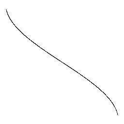

A.2. Inverse hyperbolic cosine (acosh)
--------------------------------------

ASCII rendering.

.. include:: ./ansic/testacosh.txt
   :literal:

Bitmap rendering.

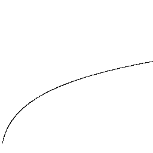

A.3. Arc cotangent (acot)
-------------------------

ASCII rendering.

.. include:: ./ansic/testacot.txt
   :literal:

Bitmap rendering.

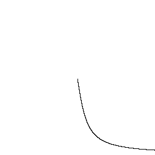

A.4. Inverse hyperbolic cotangent (acoth)
-----------------------------------------

ASCII rendering.

.. include:: ./ansic/testacoth.txt
   :literal:

Bitmap rendering.

.. image:: ./figures/testacoth.png
   :alt: Bitmap rendering for ``acoth``.

A.5. Arc cosecant (acsc)
------------------------

ASCII rendering.

.. include:: ./ansic/testacsc.txt
    :literal:

Bitmap rendering.

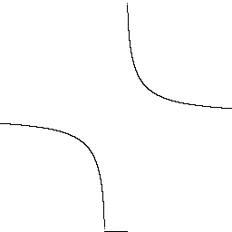

A.6. Inverse hyperbolic cosecant (acsch)
----------------------------------------

ASCII rendering.

.. include:: ./ansic/testacsch.txt
    :literal:

Bitmap rendering.

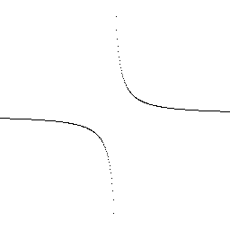

A.7. Arc secant (asec)
----------------------

ASCII rendering.

.. include:: ./ansic/testasec.txt
    :literal:

Bitmap rendering.

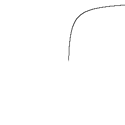

A.8. Inverse hyperbolic secant (asech)
--------------------------------------

ASCII rendering.

.. include:: ./ansic/testasech.txt
    :literal:

Bitmap rendering.

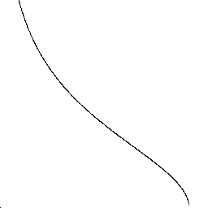

A.9. Arc sine (asin)
--------------------

ASCII rendering.

.. include:: ./ansic/testasin.txt
    :literal:

Bitmap rendering.

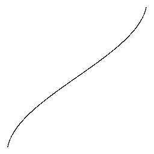

A.10. Inverse hyperbolic sine (asinh)
-------------------------------------

ASCII rendering.

.. include:: ./ansic/testasinh.txt
    :literal:

Bitmap rendering.

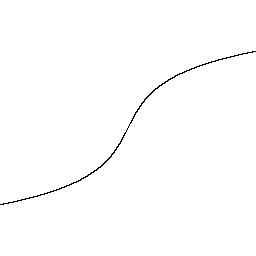

A.11. Arc tangent (atan)
------------------------

ASCII rendering.

.. include:: ./ansic/testatan.txt
    :literal:

Bitmap rendering.

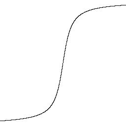

A.12. Inverse hyperbolic tangent (atanh)
----------------------------------------

ASCII rendering.

.. include:: ./ansic/testatanh.txt
    :literal:

Bitmap rendering.

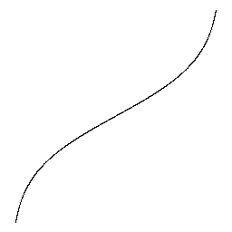

A.13. Cosine (cos)
------------------

ASCII rendering.

.. include:: ./ansic/testcos.txt
    :literal:

Bitmap rendering.

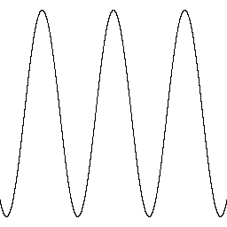

A.14. Hyperbolic cosine (cosh)
------------------------------

ASCII rendering.

.. include:: ./ansic/testcosh.txt
    :literal:

Bitmap rendering.

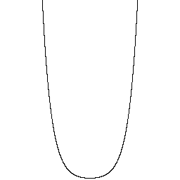

A.15. Cotangent (cot)
---------------------

ASCII rendering.

.. include:: ./ansic/testcot.txt
    :literal:

Bitmap rendering.

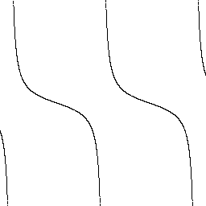

A.16. Hyperbolic cotangent (coth)
---------------------------------

ASCII rendering.

.. include:: ./ansic/testcoth.txt
    :literal:

Bitmap rendering.

.. image:: ./figures/testcoth.png
   :alt: Bitmap rendering for ``coth``.

A.17. Cosecant (csc)
--------------------

ASCII rendering.

.. include:: ./ansic/testcsc.txt
    :literal:

Bitmap rendering.

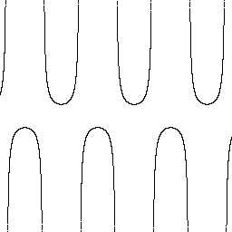

A.18. Hyperbolic cosecant (csch)
--------------------------------

ASCII rendering.

.. include:: ./ansic/testcsch.txt
    :literal:

Bitmap rendering.

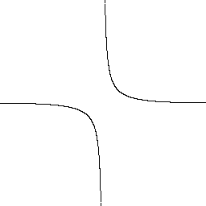

A.19. Exponential (exp)
-----------------------

ASCII rendering.

.. include:: ./ansic/testexp.txt
    :literal:

Bitmap rendering.

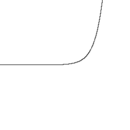

A.20. Natural logarithm (log)
-----------------------------

ASCII rendering.

.. include:: ./ansic/testlog.txt
    :literal:

Bitmap rendering.

A.21. Secant (sec)
------------------

ASCII rendering.

.. include:: ./ansic/testsec.txt
    :literal:

Bitmap rendering.

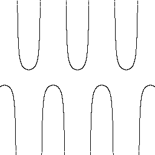

A.22. Hyperbolic secant (sech)
------------------------------

ASCII rendering.

.. include:: ./ansic/testsech.txt
    :literal:

Bitmap rendering.

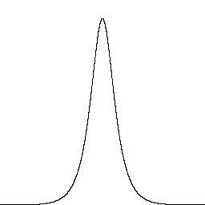

A.23. Sine (sin)
----------------

ASCII rendering.

.. include:: ./ansic/testsin.txt
    :literal:

Bitmap rendering.

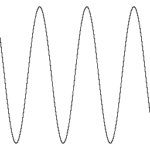

A.24. Hyperbolic sine (sinh)
----------------------------

ASCII rendering.

.. include:: ./ansic/testsinh.txt
    :literal:

Bitmap rendering.

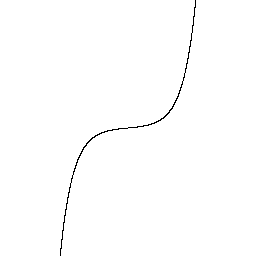

A.25. Square root (sqrt)
------------------------

ASCII rendering.

.. include:: ./ansic/testsqrt.txt
    :literal:

Bitmap rendering.

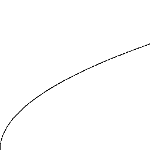

A.26. Tangent (tan)
-------------------

ASCII rendering.

.. include:: ./ansic/testtan.txt
    :literal:

Bitmap rendering.

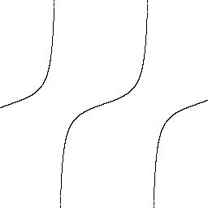

A.27. Hyperbolic tangent (tanh)
-------------------------------

ASCII rendering.

.. include:: ./ansic/testtanh.txt
    :literal:

Bitmap rendering.

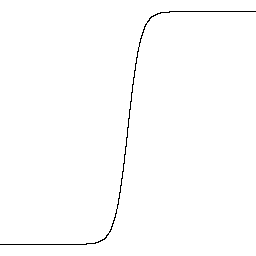

